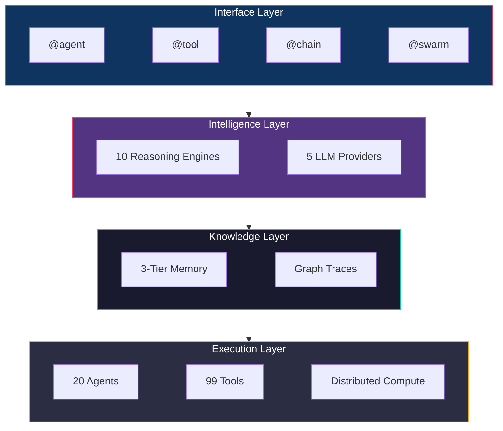
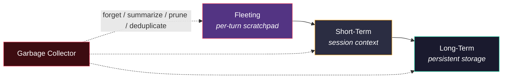

<p align="center">
  
</p>

<p align="center">
  <a href="https://github.com/v10z/openagentflow/blob/main/LICENSE">
    
  </a>
  
  
  
  <a href="https://github.com/v10z/openagentflow">
    
  </a>
</p>

<p align="center">
  Build autonomous AI agents with four decorators, ten reasoning engines, and full execution tracing.
</p>

<p align="center">
  <a href="docs/getting-started.md">Getting Started</a> &middot;
  <a href="docs/agents.md">Agents</a> &middot;
  <a href="docs/tools.md">Tools</a> &middot;
  <a href="docs/reasoning.md">Reasoning</a> &middot;
  <a href="docs/memory.md">Memory</a> &middot;
  <a href="docs/configuration.md">Configuration</a>
</p>

---

## What is OpenAgentFlow?

OpenAgentFlow is a Python framework for building autonomous AI agents that think, act, and remember. Every thought, tool call, and decision is recorded as a graph trace you can inspect, debug, and replay.

```python
from openagentflow import agent, tool

@tool
def search(query: str) -> list[dict]:
    """Search for information."""
    return [{"title": "Result", "url": "https://example.com"}]

@agent(model="claude-sonnet-4-20250514", tools=[search])
async def researcher(question: str) -> str:
    """Research agent that searches and synthesizes answers."""
    pass  # ReAct loop handles execution

result = await researcher("What are the latest AI trends?")
print(result.output)
```

Four decorators cover every agent pattern:

| Decorator | Pattern | What it does |
|-----------|---------|-------------|
| `@agent` | Autonomous | LLM-powered ReAct loop with tool use |
| `@tool` | Function | Pure Python with auto-generated JSON Schema |
| `@chain` | Sequential | Pipeline of agents, output flows to next input |
| `@swarm` | Parallel | Run agents concurrently, synthesize consensus |

## Architecture



## Install

```bash
pip install openagentflow            # Core
pip install openagentflow[anthropic] # + Anthropic Claude
pip install openagentflow[all]       # + All providers
```

No API key required — works out of the box with [Claude Code CLI](https://docs.anthropic.com/claude-code) or local [Ollama](https://ollama.ai) models.

## Key Features

### 10 Reasoning Engines

Go beyond basic ReAct and Chain-of-Thought. Each engine implements a cognitive architecture that structures *how* the LLM thinks, not just *what* it's asked.

```python
from openagentflow.reasoning import AdversarialSelfPlay

engine = AdversarialSelfPlay(max_rounds=5)
trace = await engine.reason("Design a secure auth system", provider)
# Red team attacks, Blue team defends, Judge decides
print(trace.final_output)
```

| Engine | Strategy | Best for |
|--------|----------|----------|
| `DialecticalSpiral` | Thesis / Antithesis / Synthesis | Deep analysis |
| `DreamWakeCycle` | Divergent / Convergent oscillation | Creative solutions |
| `MetaCognitiveLoop` | Reasoning about reasoning | Complex planning |
| `AdversarialSelfPlay` | Red / Blue / Judge tribunal | Robust validation |
| `EvolutionaryThought` | Darwinian selection on ideas | Optimization |
| `FractalRecursion` | Self-similar at every scale | Hierarchical tasks |
| `ResonanceNetwork` | Thought amplification network | Coherent synthesis |
| `TemporalRecursion` | Future-self pre-mortem | Risk planning |
| `SimulatedAnnealing` | Temperature-based exploration | Escaping local optima |
| `SocraticInterrogation` | Progressive questioning | Critical thinking |

[Full documentation](docs/reasoning.md)

### 99 Built-in Tools

Pure Python functions across 9 categories — no external dependencies, instant schema from type hints.

```python
from openagentflow.tools import text, code, math, data

text.extract_emails("Contact bob@test.com")   # ['bob@test.com']
code.calculate_complexity(source)              # Cyclomatic complexity score
math.prime_factors(84)                         # [2, 2, 3, 7]
data.json_to_csv(json_string)                  # CSV conversion
```

| Category | Count | Examples |
|----------|-------|---------|
| Text Processing | 15 | slug, morse, language detection, palindromes |
| Code Analysis | 15 | complexity, functions, TODOs, naming, maintainability |
| Data Transform | 15 | JSON/CSV/YAML/XML conversion, base64, diff |
| Web/HTTP | 10 | URL parsing, link extraction, HTML to markdown |
| Math/Science | 10 | primes, fibonacci, statistics, unit conversion |
| Media | 8 | color conversion, aspect ratio, QR data |
| Date/Time | 8 | parsing, difference, weekday, business days |
| AI/ML Helpers | 8 | token counting, chunking, keywords, cost estimation |
| System/File | 10 | file size, sanitize names, UUID, hashing, env parsing |

[Full documentation](docs/tools.md)

### 20 Specialized Agents

Pre-built agents for code quality, security, testing, documentation, refactoring, and more.

```python
from openagentflow import swarm

@swarm(agents=["style_enforcer", "vulnerability_scanner", "test_generator"],
       strategy="synthesis")
async def full_review(code: str) -> dict:
    """Run three agents in parallel, synthesize results."""
    pass
```

[Full documentation](docs/agents.md)

### 3-Tier Memory System

Agents remember across turns and sessions with automatic lifecycle management.



```python
from openagentflow.memory import MemoryManager, MemoryTier

memory = MemoryManager()
await memory.remember("pattern", "always check imports", importance=0.9)
results = await memory.recall("import issues")
context = await memory.get_context_window(max_tokens=4000)
await memory.run_gc()  # Auto-forget, prune, deduplicate
```

[Full documentation](docs/memory.md)

### Graph Tracing

Every execution is a DAG you can query, visualize, and replay.

```python
from openagentflow.graph import SQLiteGraphBackend

backend = SQLiteGraphBackend(":memory:")
await backend.add_vertex("agent-1", "agent", {"name": "planner", "run_id": "r1"})
await backend.add_vertex("tool-1", "tool", {"name": "search", "run_id": "r1"})
await backend.add_edge("agent-1", "tool-1", "CALLED", {"duration_ms": 150})
trace = await backend.get_full_trace("r1")
```

SQLite for development, [Apache TinkerPop](https://tinkerpop.apache.org/) for production. [Full documentation](docs/graph.md)

### JIT Meta-Agent

Agents that create new tools at runtime through sandboxed code generation.

```python
from openagentflow.meta import ToolFactory

factory = ToolFactory()
factory.create_tool(
    name="double",
    description="Double a number",
    source_code="def double(n: int) -> int:\n    return n * 2",
)
factory.test_tool("double", {"n": 21})  # Returns 42
```

[Full documentation](docs/meta-agent.md)

### Distributed Compute

Distribute workloads across HTTP, Docker, Kubernetes, and SSH backends.

```python
from openagentflow.distributed import ComputeCluster, ComputeNode, ComputeBackend

cluster = ComputeCluster(name="inference")
cluster.add_node(ComputeNode(
    node_id="gpu1",
    backend=ComputeBackend.HTTP,
    endpoint="http://gpu1:11434",
))
```

[Full documentation](docs/distributed.md)

### 5 LLM Providers

| Provider | API Key | Local |
|----------|---------|-------|
| Anthropic Claude | Required | No |
| OpenAI GPT | Required | No |
| Ollama | None | Yes |
| Claude Code CLI | None | Yes |
| Mock | None | Yes |

## Claude Code Integration

OpenAgentFlow ships with a [Claude Code](https://docs.anthropic.com/claude-code) skill that lets Claude use the framework during its own work.

```bash
# Install the skill:
mkdir -p ~/.claude/commands
cp .claude/commands/openagentflow.md ~/.claude/commands/
```

Then use `/openagentflow` in Claude Code to activate it. [Full documentation](docs/claude-code-skill.md)

## Documentation

| Guide | Description |
|-------|-------------|
| [Getting Started](docs/getting-started.md) | Installation, first agent, configuration |
| [Agents](docs/agents.md) | 20 specialized agents across 8 categories |
| [Tools](docs/tools.md) | 99 built-in tools across 9 categories |
| [Reasoning Engines](docs/reasoning.md) | 10 cognitive architectures for structured thinking |
| [Memory System](docs/memory.md) | 3-tier memory with automatic lifecycle management |
| [Graph Tracing](docs/graph.md) | Execution DAG recording and querying |
| [Meta-Agent](docs/meta-agent.md) | JIT tool creation with sandboxed execution |
| [Distributed Compute](docs/distributed.md) | Multi-node workload distribution |
| [Configuration](docs/configuration.md) | Providers, API keys, environment variables |
| [Claude Code Skill](docs/claude-code-skill.md) | Using OpenAgentFlow as a Claude Code skill |

## Contributing

Contributions welcome! Please open an issue or pull request.

```bash
git clone https://github.com/v10z/openagentflow.git
cd openagentflow
pip install -e ".[dev]"
pytest tests/ -v
```

## License

MIT License - see [LICENSE](LICENSE) for details.

---

<p align="center">
  Built with intelligence by AI agents
</p>
