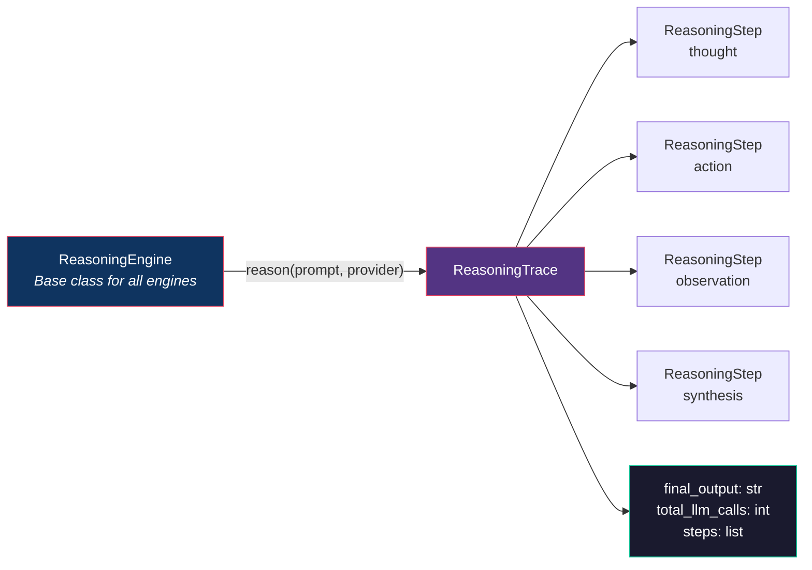

# OpenAgentFlow Reasoning Engines

## Overview

Reasoning engines are structured strategies that govern **how** an LLM thinks
through a problem, not just **what** it is asked. While basic prompt-response
interaction yields a single pass through the model, reasoning engines
orchestrate multi-step, multi-perspective, and self-correcting thought
processes that dramatically improve output quality for complex tasks.

Standard approaches like ReAct (Reason + Act) and Chain-of-Thought (CoT)
represent a starting point. OpenAgentFlow's reasoning engines go further by
implementing cognitive architectures that mirror how expert human thinkers
actually solve hard problems: through dialectical debate, adversarial stress
testing, evolutionary refinement, and metacognitive self-monitoring.

Every engine produces a **ReasoningTrace** -- a directed acyclic graph (DAG)
of reasoning steps that provides full auditability, enables debugging, and
can be persisted to the graph backend for post-hoc analysis.



### Why Not Just ReAct/CoT?

| Limitation of Basic Approaches         | What Engines Solve                      |
|-----------------------------------------|-----------------------------------------|
| Single perspective on the problem       | Multi-perspective analysis              |
| No self-correction during reasoning     | Metacognitive monitoring and adaptation |
| Vulnerable to confirmation bias         | Adversarial challenge and stress testing|
| Stuck in local optima                   | Exploration via annealing / evolution   |
| Flat reasoning (no depth hierarchy)     | Fractal and recursive decomposition     |
| No creative divergence                  | Dream-wake oscillation cycles           |

---

## Available Engines

| Engine                  | Pattern                              | Best For                                  |
|-------------------------|--------------------------------------|-------------------------------------------|
| `DialecticalSpiral`     | Thesis -> Antithesis -> Synthesis    | Deep analysis, nuanced understanding      |
| `DreamWakeCycle`        | Divergent -> Convergent oscillation  | Creative problem solving, brainstorming   |
| `MetaCognitiveLoop`     | Reasoning about reasoning            | Complex multi-step tasks, strategy adapt. |
| `AdversarialSelfPlay`   | Red / Blue / Judge tribunal          | Robust solutions, security analysis       |
| `EvolutionaryThought`   | Darwinian selection on ideas         | Optimization, design problems             |
| `FractalRecursion`      | Self-similar at every scale          | Hierarchical planning, architecture       |
| `ResonanceNetwork`      | Thought amplification network        | Coherence, consensus building             |
| `TemporalRecursion`     | Future-self pre-mortem               | Risk analysis, planning                   |
| `SimulatedAnnealing`    | Temperature-based exploration        | Escaping local optima, search             |
| `SocraticInterrogation` | Progressive questioning              | Assumption testing, critical thinking     |

---

## Usage Examples

### Basic: Single Engine

```python
from openagentflow.reasoning import DialecticalSpiral, MetaCognitiveLoop

# Use dialectical reasoning for architectural decisions
engine = DialecticalSpiral(max_depth=3)
trace = await engine.reason(
    "Should we use microservices or monolith?",
    llm_provider
)

print(trace.final_output)    # Nuanced synthesis of both sides
print(f"Reasoning depth: {len(trace.steps)} steps, {trace.total_llm_calls} LLM calls")

# Inspect individual reasoning steps
for step in trace.steps:
    print(f"  [{step.step_type}] {step.content[:80]}...")
```

### Adversarial Self-Play

```python
from openagentflow.reasoning import AdversarialSelfPlay

# Red team / Blue team / Judge for security analysis
engine = AdversarialSelfPlay(rounds=3)
trace = await engine.reason(
    "Evaluate the security of our authentication flow",
    llm_provider
)

# The trace contains Red (attack), Blue (defense), and Judge (verdict) steps
for step in trace.steps:
    if step.role == "red":
        print(f"  ATTACK: {step.content[:80]}...")
    elif step.role == "blue":
        print(f"  DEFEND: {step.content[:80]}...")
    elif step.role == "judge":
        print(f"  VERDICT: {step.content[:80]}...")

print(f"\nFinal assessment: {trace.final_output}")
```

### Evolutionary Thought

```python
from openagentflow.reasoning import EvolutionaryThought

# Generate, mutate, and select the best API design
engine = EvolutionaryThought(
    population_size=5,
    generations=3,
    mutation_rate=0.3,
)
trace = await engine.reason(
    "Design a REST API for a task management system",
    llm_provider
)

print(f"Best design after {trace.total_llm_calls} evaluations:")
print(trace.final_output)
```

### Dream-Wake Cycle

```python
from openagentflow.reasoning import DreamWakeCycle

# Alternate between wild ideation and critical evaluation
engine = DreamWakeCycle(cycles=3, dream_temperature=1.2, wake_temperature=0.3)
trace = await engine.reason(
    "Invent a new programming paradigm for distributed systems",
    llm_provider
)

# Dream phases produce creative, unconstrained ideas
# Wake phases filter, refine, and ground those ideas
print(trace.final_output)
```

### Simulated Annealing

```python
from openagentflow.reasoning import SimulatedAnnealing

# Escape local optima by exploring broadly then narrowing
engine = SimulatedAnnealing(
    initial_temperature=1.5,
    cooling_rate=0.85,
    min_temperature=0.1,
)
trace = await engine.reason(
    "Optimize the database schema for both read and write performance",
    llm_provider
)
print(trace.final_output)
```

### Socratic Interrogation

```python
from openagentflow.reasoning import SocraticInterrogation

# Progressively question assumptions to reach deeper understanding
engine = SocraticInterrogation(max_questions=7)
trace = await engine.reason(
    "Our system needs to be real-time",
    llm_provider
)

# Each step is a question that challenges the prior answer
for step in trace.steps:
    print(f"  Q: {step.question}")
    print(f"  A: {step.answer[:80]}...")
    print()

print(f"Final insight: {trace.final_output}")
```

### Temporal Recursion

```python
from openagentflow.reasoning import TemporalRecursion

# Send a message to your future self, then do a pre-mortem
engine = TemporalRecursion(time_horizons=["1 week", "1 month", "1 year"])
trace = await engine.reason(
    "We plan to migrate from PostgreSQL to DynamoDB",
    llm_provider
)

# Each horizon produces a future-self retrospective
print(trace.final_output)
```

### Fractal Recursion

```python
from openagentflow.reasoning import FractalRecursion

# Apply the same analysis pattern at every level of abstraction
engine = FractalRecursion(max_depth=3, branching_factor=3)
trace = await engine.reason(
    "Design the architecture for a real-time collaboration platform",
    llm_provider
)

# The trace is a tree: high-level -> subsystems -> components
print(trace.final_output)
```

### Resonance Network

```python
from openagentflow.reasoning import ResonanceNetwork

# Multiple thought threads amplify and reinforce each other
engine = ResonanceNetwork(num_threads=4, resonance_rounds=3)
trace = await engine.reason(
    "What is the best approach to error handling in distributed systems?",
    llm_provider
)
print(trace.final_output)
```

---

## Composition

Engines can be composed together. The `MetaCognitiveLoop` is designed to act
as an orchestrator that dynamically selects sub-strategies based on how
reasoning is progressing.

```python
from openagentflow.reasoning import MetaCognitiveLoop

# Meta-cognitive loop with dynamic strategy switching
meta = MetaCognitiveLoop(
    available_strategies=["dialectical", "adversarial", "evolutionary"],
    max_iterations=5,
)
trace = await meta.reason(
    "Design a fault-tolerant payment processing system",
    llm_provider
)

# The meta-loop monitors its own reasoning quality and switches
# strategies when progress stalls:
#   Iteration 1: Tries dialectical -> good progress
#   Iteration 2: Continues dialectical -> progress stalling
#   Iteration 3: Switches to adversarial -> finds blind spots
#   Iteration 4: Switches to evolutionary -> optimizes solution
#   Iteration 5: Final synthesis
print(trace.final_output)
print(f"Strategies used: {trace.strategies_used}")
```

### Nesting Engines

```python
from openagentflow.reasoning import FractalRecursion, AdversarialSelfPlay

# At each fractal level, use adversarial self-play to stress-test the design
fractal = FractalRecursion(
    max_depth=2,
    branching_factor=3,
    sub_engine=AdversarialSelfPlay(rounds=2),
)
trace = await fractal.reason(
    "Design a secure multi-tenant SaaS platform",
    llm_provider
)
```

---

## Comparison Matrix

### When to Use Which Engine

```
                        START
                          |
                    Is the problem
                    well-defined?
                   /              \
                 YES               NO
                  |                 |
           Need to find        Need creative
           the BEST answer?    exploration?
          /          \          /          \
        YES          NO       YES          NO
         |            |        |            |
   Is the search   Need to   DreamWake    Socratic
   space huge?     validate?  Cycle        Interrogation
    /       \        |
  YES       NO   Adversarial
   |         |   SelfPlay
Simulated  Evolutionary
Annealing  Thought
                          |
                    Is it hierarchical
                    / multi-level?
                   /              \
                 YES               NO
                  |                 |
            Fractal            Need multiple
            Recursion          perspectives?
                              /              \
                            YES               NO
                             |                 |
                       Dialectical        Is there risk
                       Spiral             of failure?
                                         /           \
                                       YES            NO
                                        |              |
                                   Temporal        Resonance
                                   Recursion       Network

           Not sure? --> MetaCognitiveLoop (auto-selects)
```

### Performance Characteristics

| Engine                  | LLM Calls (typical) | Latency    | Quality | Best Problem Size |
|-------------------------|----------------------|------------|---------|-------------------|
| `DialecticalSpiral`     | 3 - 9                | Medium     | High    | Focused decisions |
| `DreamWakeCycle`        | 6 - 18               | Medium     | High    | Open-ended        |
| `MetaCognitiveLoop`     | 5 - 25               | High       | Highest | Any complex task  |
| `AdversarialSelfPlay`   | 6 - 18               | Medium     | High    | Validation        |
| `EvolutionaryThought`   | 15 - 60              | High       | High    | Optimization      |
| `FractalRecursion`      | 3^d (depth d)        | Very High  | High    | Hierarchical      |
| `ResonanceNetwork`      | 8 - 24               | Medium     | Medium  | Consensus         |
| `TemporalRecursion`     | 3 - 9                | Low-Medium | Medium  | Risk/planning     |
| `SimulatedAnnealing`    | 10 - 40              | High       | High    | Search problems   |
| `SocraticInterrogation` | 4 - 14               | Medium     | Medium  | Clarification     |

### Quality vs. Speed Tradeoff

```
Quality
  ^
  |  *MetaCognitive
  |       *Evolutionary
  |    *Adversarial  *Dialectical
  |        *DreamWake     *SimAnnealing
  |   *FractalRecursion
  |          *Resonance
  |     *Temporal    *Socratic
  |
  +-------------------------------------------> Speed
  Fast                                    Slow
```

---

## Architecture

### How Engines Integrate with OpenAgentFlow

```
Agent (@agent decorator)
    |
    |-- reasoning_strategy: ReasoningStrategy enum
    |       REACT, COT, TOT, REFLEXION, CUSTOM
    |
    +-- When CUSTOM, the agent delegates to a ReasoningEngine:

Agent (@agent) ----> ReasoningEngine.reason(prompt, llm_provider)
                          |
                          |-- [Internal multi-step process]
                          |     |
                          |     +-- LLM call 1 (e.g., thesis)
                          |     +-- LLM call 2 (e.g., antithesis)
                          |     +-- LLM call 3 (e.g., synthesis)
                          |
                          +---> ReasoningTrace
                                  |
                                  +-- steps: list[ReasoningStep]
                                  |     |-- step_type: str
                                  |     |-- content: str
                                  |     |-- metadata: dict
                                  |     +-- parent_step_id: str | None
                                  |
                                  +-- final_output: str
                                  +-- total_llm_calls: int
                                  +-- duration_ms: float
                                  |
                                  +---> Graph Backend (optional)
                                          |
                                          +-- Vertex per ReasoningStep
                                          +-- Edges: LEADS_TO, CHALLENGES, SYNTHESIZES
```

### Core Types

```python
@dataclass
class ReasoningStep:
    """A single step in the reasoning process."""
    step_id: str
    step_type: str          # "thought", "action", "observation", "synthesis", etc.
    content: str            # The actual reasoning content
    parent_step_id: str | None  # For DAG structure
    metadata: dict          # Engine-specific data (role, temperature, generation, etc.)
    llm_calls: int          # Number of LLM calls this step required
    created_at: datetime

@dataclass
class ReasoningTrace:
    """Complete trace of a reasoning process -- a DAG of steps."""
    trace_id: str
    engine_name: str
    prompt: str
    steps: list[ReasoningStep]
    final_output: str
    total_llm_calls: int
    duration_ms: float
    metadata: dict          # Engine-specific summary data

class ReasoningEngine(ABC):
    """Abstract base class for all reasoning engines."""

    @abstractmethod
    async def reason(
        self,
        prompt: str,
        llm_provider: BaseLLMProvider,
        **kwargs,
    ) -> ReasoningTrace:
        """Execute the reasoning strategy and return a trace."""
        ...
```

### Execution Flow

```
1. User calls: result = await my_agent("Design a payment system")

2. @agent decorator builds AgentSpec with reasoning_strategy

3. AgentExecutor._react_loop() runs the ReAct loop:
       |
       +-- If strategy is CUSTOM and a ReasoningEngine is configured:
       |       engine.reason(prompt, provider) -> ReasoningTrace
       |       trace is recorded in graph backend
       |       final_output is used as the agent's response
       |
       +-- Otherwise: standard ReAct loop (LLM -> tool calls -> repeat)

4. ReasoningTrace is attached to AgentResult for inspection

5. If graph_backend is provided:
       Each ReasoningStep -> vertex in the execution DAG
       Step relationships -> edges (LEADS_TO, CHALLENGES, SYNTHESIZES, etc.)
```

---

## Creating Custom Engines

To create a custom reasoning engine, subclass `ReasoningEngine` and implement
the `reason` method.

### Minimal Example

```python
from openagentflow.reasoning import ReasoningEngine, ReasoningStep, ReasoningTrace
from openagentflow.llm.base import BaseLLMProvider
from openagentflow.core.types import Message
from datetime import datetime, timezone
from uuid import uuid4
import time


class PingPongReasoning(ReasoningEngine):
    """A simple engine that bounces between two perspectives."""

    def __init__(self, rounds: int = 3):
        self.rounds = rounds

    async def reason(
        self,
        prompt: str,
        llm_provider: BaseLLMProvider,
        **kwargs,
    ) -> ReasoningTrace:
        start = time.time()
        steps: list[ReasoningStep] = []
        total_calls = 0

        perspective_a = ""
        perspective_b = ""

        for i in range(self.rounds):
            # Perspective A
            response_a = await llm_provider.generate(
                messages=[Message(
                    role="user",
                    content=(
                        f"Given: {prompt}\n"
                        f"Previous counterpoint: {perspective_b}\n"
                        f"Argue FOR this position (round {i+1}/{self.rounds}):"
                    ),
                )],
                config=None,
            )
            perspective_a = response_a.content
            total_calls += 1

            steps.append(ReasoningStep(
                step_id=str(uuid4()),
                step_type="argument_for",
                content=perspective_a,
                parent_step_id=steps[-1].step_id if steps else None,
                metadata={"round": i + 1, "perspective": "for"},
                llm_calls=1,
                created_at=datetime.now(timezone.utc),
            ))

            # Perspective B
            response_b = await llm_provider.generate(
                messages=[Message(
                    role="user",
                    content=(
                        f"Given: {prompt}\n"
                        f"Previous argument: {perspective_a}\n"
                        f"Argue AGAINST this position (round {i+1}/{self.rounds}):"
                    ),
                )],
                config=None,
            )
            perspective_b = response_b.content
            total_calls += 1

            steps.append(ReasoningStep(
                step_id=str(uuid4()),
                step_type="argument_against",
                content=perspective_b,
                parent_step_id=steps[-1].step_id,
                metadata={"round": i + 1, "perspective": "against"},
                llm_calls=1,
                created_at=datetime.now(timezone.utc),
            ))

        # Final synthesis
        synthesis_response = await llm_provider.generate(
            messages=[Message(
                role="user",
                content=(
                    f"Original question: {prompt}\n\n"
                    f"Arguments FOR:\n{perspective_a}\n\n"
                    f"Arguments AGAINST:\n{perspective_b}\n\n"
                    "Synthesize a balanced final answer:"
                ),
            )],
            config=None,
        )
        total_calls += 1

        steps.append(ReasoningStep(
            step_id=str(uuid4()),
            step_type="synthesis",
            content=synthesis_response.content,
            parent_step_id=steps[-1].step_id,
            metadata={"round": "final"},
            llm_calls=1,
            created_at=datetime.now(timezone.utc),
        ))

        duration_ms = (time.time() - start) * 1000

        return ReasoningTrace(
            trace_id=str(uuid4()),
            engine_name="PingPongReasoning",
            prompt=prompt,
            steps=steps,
            final_output=synthesis_response.content,
            total_llm_calls=total_calls,
            duration_ms=duration_ms,
            metadata={"rounds": self.rounds},
        )
```

### Using a Custom Engine with an Agent

```python
from openagentflow import agent

@agent(
    model="claude-sonnet-4-20250514",
    reasoning_strategy="custom",
)
async def debater(question: str) -> str:
    """Agent that uses ping-pong reasoning."""
    ...

# The executor will use the custom engine when reasoning_strategy is CUSTOM
# and a ReasoningEngine instance is attached to the agent spec.
```

### Design Guidelines for Custom Engines

1. **Always produce a ReasoningTrace**: Every engine must return a complete
   trace with all steps, even on partial failure. This ensures auditability.

2. **Track LLM calls accurately**: The `total_llm_calls` field is used for
   cost estimation and performance monitoring.

3. **Use step types consistently**: Define a clear vocabulary of step types
   for your engine (e.g., `"thesis"`, `"antithesis"`, `"synthesis"` for
   dialectical reasoning).

4. **Handle LLM failures gracefully**: If an intermediate LLM call fails,
   record the failure as a step and attempt to continue or synthesize from
   what you have.

5. **Respect parent_step_id**: Build proper DAG structure so the trace can
   be visualized and navigated. Steps that depend on prior steps should
   reference them.

6. **Keep engines stateless**: Engines should not store state between calls
   to `reason()`. All state lives in the `ReasoningTrace`.

---

## Engine Design Details

### DialecticalSpiral

Implements Hegelian dialectics: thesis, antithesis, synthesis. At each
depth level, the synthesis of the previous level becomes the new thesis,
generating increasingly refined understanding.

```
Depth 1:  Thesis(prompt) -> Antithesis -> Synthesis_1
Depth 2:  Thesis(Synthesis_1) -> Antithesis -> Synthesis_2
Depth 3:  Thesis(Synthesis_2) -> Antithesis -> Final Synthesis
```

LLM calls: `3 * max_depth`

### MetaCognitiveLoop

Monitors its own reasoning quality and dynamically switches strategies.
Each iteration: (1) reason with current strategy, (2) evaluate quality,
(3) decide whether to continue, switch, or finalize.

```
Iteration 1: [Strategy A] -> Evaluate -> "Progress good, continue"
Iteration 2: [Strategy A] -> Evaluate -> "Stalling, switch to B"
Iteration 3: [Strategy B] -> Evaluate -> "Found blind spot, switch to C"
Iteration 4: [Strategy C] -> Evaluate -> "Sufficient quality, finalize"
```

LLM calls: `2-3 per iteration` (reason + evaluate + optional switch)

### AdversarialSelfPlay

Three personas debate: Red (attacker/critic), Blue (defender/builder),
and Judge (evaluator). Multiple rounds of attack-defend-judge produce
robust, stress-tested outputs.

```
Round 1: Red attacks -> Blue defends -> Judge scores
Round 2: Red attacks (new angle) -> Blue defends -> Judge scores
Round 3: Red attacks (hardest) -> Blue defends -> Judge final verdict
```

LLM calls: `3 * rounds + 1` (final synthesis)

### EvolutionaryThought

Generates a population of candidate solutions, evaluates fitness, selects
the best, mutates them, and repeats for multiple generations.

```
Gen 0: Generate N candidates -> Evaluate fitness -> Select top K
Gen 1: Mutate top K -> Generate new candidates -> Evaluate -> Select
Gen 2: Mutate top K -> Generate new candidates -> Evaluate -> Select
Final: Best candidate from last generation
```

LLM calls: `population_size * generations + generations` (eval calls)

### FractalRecursion

Applies the same analytical pattern recursively at every level of
abstraction. The top level decomposes the problem into sub-problems;
each sub-problem is analyzed identically, producing a self-similar tree.

```
Level 0: Analyze(problem) -> [Sub-problem A, B, C]
Level 1: Analyze(A) -> [A1, A2, A3]
         Analyze(B) -> [B1, B2, B3]
         Analyze(C) -> [C1, C2, C3]
Level 2: Analyze(A1) -> ... (leaf analysis)
         ...
Final:   Bottom-up synthesis from leaves to root
```

LLM calls: `O(branching_factor ^ max_depth)` -- use with care

---

## Module Structure

```
openagentflow/reasoning/
    __init__.py              # Public API exports
    base.py                  # ReasoningEngine, ReasoningStep, ReasoningTrace
    metacognitive.py         # MetaCognitiveLoop
    adversarial.py           # AdversarialSelfPlay
    dialectical.py           # DialecticalSpiral
    dream_wake.py            # DreamWakeCycle
    evolutionary.py          # EvolutionaryThought
    fractal.py               # FractalRecursion
    resonance.py             # ResonanceNetwork
    temporal.py              # TemporalRecursion
    annealing.py             # SimulatedAnnealing
    socratic.py              # SocraticInterrogation
```

---

## Further Reading

- `openagentflow/core/types.py` -- `ReasoningStrategy` enum and `AgentSpec`
- `openagentflow/runtime/executor.py` -- `AgentExecutor` and the ReAct loop
- `openagentflow/core/agent.py` -- `@agent` decorator with `reasoning_strategy` parameter
- `openagentflow/memory/` -- Memory system that reasoning engines can read/write
- `openagentflow/graph/` -- Graph backend where `ReasoningTrace` DAGs are persisted
